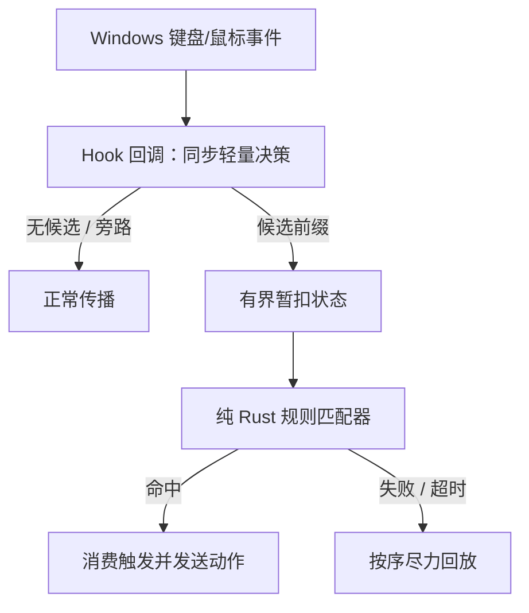

# InputFlow 项目规划与 AI 开发规格

> 状态：规划稿 v0.1（2026-09-26）  
> 平台：Windows 桌面  
> 本文用途：定义产品边界、技术假设、验收条件与开发顺序；后续 AI 实现时以本文件为项目上下文。  
> 来源：根据最初的交互重映射想法及提供的讨论文本整理。文中的方案尚未经过 Windows 实机验证；标为“待验证”的内容不能当作已实现功能。

## 1. 项目概述

InputFlow 是一个 Windows 全局键盘与鼠标输入组合引擎。用户可以把按住、点击和键鼠组合定义为触发条件，并指定要发出的键盘或鼠标动作。程序只暂扣**可能构成已启用规则的事件**；匹配失败或超时时，尽快将暂扣事件按顺序回放。

最初的使用需求是“长按左 Ctrl 执行复制”，以及“按住某键并点击鼠标按键执行自定义操作”。可用版本的代表规则是：

```text
按住左 Ctrl 至少 250 ms，再按下鼠标右键 → 执行 Ctrl+C
```

独立的 `长按左 Ctrl → Ctrl+C` 也是目标规则，但它与以左 Ctrl 为前缀的其他组合可能冲突；MVP 必须明确处理冲突后才允许同时启用。

**核心研究问题**：怎样延迟对少量潜在规则前缀的解释，以识别自定义时序和键鼠组合，同时控制未匹配输入的延迟、状态偏差与功能损失？

### 1.1 产品目标

| 目标 | 可观察结果 |
|---|---|
| 表达能力 | 支持左右键区分、按住时长、键鼠组合、键盘快捷键输出。 |
| 低干扰 | 非规则前缀直接放行；暂扣有明确期限；无规则时不影响输入。 |
| 可恢复 | 暂扣队列有界；用户可暂停规则；异常路径优先停止继续拦截。 |
| 易用 | 用户用可读的按键名称配置，不必直接编辑扫描码。 |
| 可研究 | 核心匹配器脱离 Windows API，能以事件序列做确定性测试。 |

### 1.2 用户故事

1. 我可以将左 Ctrl 按住一定时间后与鼠标右键组合，映射为复制快捷键。
2. 我按普通 `Ctrl+Q` 时，如果不存在匹配规则，按键仍应到达原应用，且不出现额外的释放或重复按键。
3. 我能暂时关闭规则，恢复普通键鼠行为，而不必卸载程序。
4. 我在规则编辑器中能看到规则冲突或可能造成明显输入延迟的提示。

## 2. 范围与交付边界

### 2.1 MVP 必须交付

- 当前用户会话中的全局键盘按下/松开和鼠标按键按下/松开处理；保留左右修饰键区分。
- `Hold(key, threshold)`、`Hold(key) + MouseButton` 和基础 `Key + Key` 组合；同一配置中冲突规则先拒绝并解释原因。
- 输出基础键盘快捷键及鼠标按键动作；规则可启用、停用、编辑与删除。
- 非候选事件直接放行；候选事件暂扣、成功消费、失败/超时回放；按下与松开状态一致。
- 暂停/恢复、紧急退出或旁路、规则文件校验、失败后可见的状态与基本诊断日志。
- 本地配置文件和简单桌面规则编辑界面；在规则录制不稳定之前，允许用表单编辑先完成 MVP。

### 2.2 暂不包含

触控板原生手势、驱动、按具体设备绑定、宏录制、序列和层、按应用切换、云同步、插件、跨平台、管理员程序的全面兼容、系统安全桌面的输入控制。媒体音量、启动应用和系统操作可在基础引擎稳定后扩展。

### 2.3 “原样输入”的准确含义

目标是**尽可能保留普通应用可观察到的输入顺序和按键状态**，不是保证与原始物理输入完全等价。`SendInput` 生成的是合成事件；事件时间、注入标志、目标焦点和某些应用的处理方式可能不同。发现无法安全回放的场景，应停止进一步暂扣并记录限制，不应宣称“100% 原样”。

## 3. 功能需求

| ID | 要求 | MVP 验收依据 |
|---|---|---|
| FR-01 | 观察键盘和鼠标按钮的按下/松开事件。 | 日志显示左右 Ctrl、普通键、左右鼠标键的事件与先后顺序。 |
| FR-02 | 用已启用规则的前缀决定是否暂扣。 | 无候选规则的键直接放行；禁用全部规则时不暂扣。 |
| FR-03 | 识别按住时长和键鼠组合。 | 阈值内/外及不同第二输入均产生预期判定。 |
| FR-04 | 匹配失败或超时后回放暂扣事件。 | 普通快捷键、快速敲击、松开等场景无丢键或卡键。 |
| FR-05 | 命中后消费触发输入并发送动作。 | 动作仅触发一次，匹配到的右键不弹出原菜单。 |
| FR-06 | 区分本程序生成的输入与其他输入。 | 本程序回放和动作不会再次触发规则。 |
| FR-07 | 管理规则并持久化配置。 | 重启后规则保持；冲突/非法配置给出可理解错误。 |
| FR-08 | 一键旁路或暂停。 | 规则关闭后正常输入可继续使用；状态在界面可见。 |
| FR-09 | 记录匿名化的运行诊断信息。 | 可定位回放失败、超时、队列溢出、hook 状态；默认不记录键入的文本内容。 |

### 3.1 规则语义（先固定，再编码）

- `Hold(K, T)`：从物理 `K down` 到计时达到 `T`；按键重复 down 不重置计时。若在 `T` 前释放则不命中。
- `Hold(K, T) + Button(B)`：达到 `T` 后且 `K` 仍物理按住，随后发生 `B down` 才命中；本次 `B up` 与已消费的 down 一同处理，避免孤立释放。具体是否允许“先按 B 再达到 T”，MVP 定为**不允许**。
- `Key + Key`：第二键在第一键按住期间按下。若第一键过早释放，规则失败。
- 同一触发只执行一次；按键自动重复不再触发新的匹配。每个物理 down 对应的 up 必须有明确归属。
- 长按单键与“同键前缀 + 其他输入”同时配置时，MVP 先判为冲突并拒绝启用，不暗中选优先级。
- 规则允许配置的按键设置白名单；系统保留组合及无法可靠接管的键应拒绝配置或走旁路。具体列表在 Windows 实机测试后确定。

## 4. 非功能需求与安全界限

| ID | 约束 | 验证方式 |
|---|---|---|
| NFR-01 | Hook 回调只做事件归一化、极轻量的规则前缀/当前状态判定和有界入队；不得等待 UI、磁盘或网络。 | 性能采样和代码审查。 |
| NFR-02 | 暂扣队列、规则解析期限和内存使用都有上限；到上限时旁路新事件并尝试冲刷已有事件。 | 溢出与超时测试。 |
| NFR-03 | 缺失或无效配置不能阻止程序启动；默认无规则旁路。 | 损坏配置启动测试。 |
| NFR-04 | 拦截状态与按键状态必须一致；任何已消费的 down 不可把其 up 裸露给应用。 | 事件序列模型测试与实机测试。 |
| NFR-05 | 日志默认不存储实际输入文本、密码或窗口标题；调试采集必须明确开启。 | 检查默认配置和日志样本。 |
| NFR-06 | Windows 版本、CPU 架构、构建依赖与测试机器在首次实现时固定并写入 README。 | 安装/构建记录。 |

延迟预算先作为**测量目标**，不是没有证据的性能承诺：记录直通事件回调耗时和暂扣事件总延迟的 p50/p95/p99；在 M2 原型上测出基线，再给 MVP 设具体阈值。规则超时与缓冲上限要有可配置默认值和硬上限，例如 250 ms 的长按阈值、有限事件数的队列；具体值必须以测试调整。

**失效原则**：后续新输入应尽量放行；对已经被拦截的事件只能“尽力回放”。如果进程在暂扣后突然终止，用户焦点或物理按键状态可能已经变化，程序无法保证恢复此前被吞掉的事件。不能把“崩溃时自动完整 flush”当作已有保证。

## 5. 技术架构



**关键约束**：Hook 是否阻止当前事件，必须在该回调返回前决定。因此“把全部决策交给工作线程并立即返回”不可行。实现可以把复杂规则预编译成适合回调快速查询的状态，计时、日志、配置读写与 GUI 放在工作线程；跨线程状态传递需有界且不得让 Hook 长时间阻塞。

### 5.1 模块与职责

| 模块 | 职责 |
|---|---|
| `platform/windows` | Hook 安装/卸载、消息循环、事件转换、`SendInput` 调用；集中管理 `unsafe`。 |
| `engine/event` | 键/鼠标事件、时间戳、扩展键/扫描码、注入来源、顺序编号。 |
| `engine/matcher` | 纯逻辑状态机、前缀匹配、时间推进、成功/失败判定。 |
| `engine/pending` | 有界暂扣、释放配对、回放次序、溢出策略。 |
| `engine/rules` | 规则校验、冲突检测、预编译与热更新。 |
| `output` | 动作生成、本程序注入标记、错误上报。 |
| `config` | 版本化配置、原子保存、坏文件回退。 |
| `ui` | 规则列表、编辑器、状态、录制触发器（后续）、诊断入口。 |

### 5.2 核心接口草案

```rust
enum Decision {
    PassThrough,
    Suppress { event_id: u64 },
}

enum Resolution {
    Pending,
    Matched { rule_id: String, action: Action },
    Failed { replay: Vec<InputEvent> },
}

// 逻辑时钟可注入：测试不依赖真实睡眠。
// on_event 必须同步返回当前事件的处理决定；
// on_timeout 在期限到达时推进状态并产出后续命令。
```

`InputEvent` 至少包含：事件来源（键盘/鼠标）、虚拟键与扫描码、左右/扩展键标记、按下/松开、单调时间戳、顺序 ID、注入标记，以及鼠标按键/滚轮数据（如启用）。不要把 `physical=true/false` 简化成可信的设备身份；低级 Hook 无法直接提供每个物理设备的可靠身份。

### 5.3 注入与回放

- `SendInput` 用于输出快捷键及回放；调用方检查实际插入数量，记录失败并进入旁路状态。
- 注入事件带本程序的 `dwExtraInfo` 标记，并结合 Hook 的 injected flag 识别。**仅本程序生成的事件**默认排除规则匹配；其他软件注入的输入采用明确的旁路策略，不能把所有 injected 事件都认成自己的。
- 模型同时维护“物理上按住了哪些键”和“目标应用已经看到哪些键”。当某个 down 已放行、已暂扣、已回放或已消费时，它之后的 up 按对应状态处理。
- 暂扣失败时先回放有序前缀，再让后续事件按正确顺序传播；必要时对后续事件也短暂协调，防止 `Q down` 比被暂扣的 `Ctrl down` 先到达目标应用。
- 发送 `Ctrl+C` 时要考虑物理 Ctrl 已被按住及其他修饰键状态；不能假定 `SendInput` 会重置当前键盘状态。鼠标按键同样需要成对处理。
- 前台窗口变化、权限边界、输入法、游戏/Raw Input 程序都可能改变回放结果；应作为实机兼容性测试项目记录。

### 5.4 规则配置示例（提案，不是既有格式）

```json
{
  "schema_version": 1,
  "enabled": true,
  "rules": [
    {
      "id": "hold-left-ctrl-right-click-copy",
      "enabled": true,
      "trigger": {
        "type": "hold_then_mouse_button",
        "key": "LeftCtrl",
        "hold_ms": 250,
        "button": "Right",
        "phase": "down"
      },
      "action": {
        "type": "keyboard_shortcut",
        "keys": ["LeftCtrl", "C"]
      }
    }
  ]
}
```

配置加载时校验类型、阈值范围、重复 ID、保留组合和规则冲突；只把完整有效的规则集一次性交给引擎。具体字段和保存路径在编码前通过一个小型设计决定确认。

## 6. 典型事件流与需要保护的状态

| 场景 | 期望处理 | 关键风险 |
|---|---|---|
| 按 `A`，无 A 前缀 | A down/up 直接通过 | 非候选不能排队等待。 |
| 左 Ctrl down，随后 Q down | 暂扣 Ctrl；确认不匹配后按序送出 Ctrl、Q，继续处理 up | Ctrl 与 Q 顺序颠倒；松开孤立。 |
| 左 Ctrl 保持 250 ms 后右键 down | 消费匹配输入、执行一次 Ctrl+C，处理后续右键 up/Ctrl up | 原右键菜单弹出；动作重复；卡住 Ctrl。 |
| 左 Ctrl 按住不足阈值后松开 | 回放合理的 Ctrl down/up 序列 | 单独点击 Ctrl 意外复制。 |
| 左 Ctrl 按住期间进入其他应用 | 按已定义焦点策略处理，必要时放弃匹配并旁路 | 回放送到与原输入不同的窗口。 |
| 程序暂停或配置热更新 | 不创建新的暂扣；清理现有状态后切换 | 切换中出现悬空 down/up。 |
| 注入的 Ctrl+C 再次被 Hook 看到 | 识别本程序标记并旁路 | 自触发递归。 |
| 进程崩溃/被强制终止 | 新事件由 Windows 正常处理；启动后提示上次异常 | 已经暂扣的输入无法保证恢复。 |

注意：上表中的“按序送出”是要通过实验验证的设计目标。直接在匹配失败时调用一次 `SendInput(Ctrl down, Q down)`，同时让物理 Q up/Ctrl up 自行通过，并不足以证明各场景都正确。

## 7. 技术选型与开发环境

| 层 | 初始选型 | 原因/时点 |
|---|---|---|
| 核心 | Rust stable | 事件状态机、并发边界、可独立测试。 |
| Windows API | `windows` 或 `windows-sys`（windows-rs） | M1 用最少 API 验证；锁定 crate 版本。 |
| 输入接入 | `WH_KEYBOARD_LL`、`WH_MOUSE_LL` | 原型验证观察和可选抑制；需要专用消息循环线程。 |
| 输入输出 | `SendInput` | 发送合成键鼠事件；需验证返回值和权限限制。 |
| 配置 | JSON + `serde` | 可读、可版本化；GUI 阶段用原子保存。 |
| GUI | Tauri 2 + React + TypeScript | 等引擎可靠后再接入；前端不持有 Hook。 |
| 测试/构建 | Cargo、Windows 实机测试、npm、Git | 匹配器测试在 CI；Hook/回放必须实机验证。 |

开发机器需 Windows 10/11 桌面环境、Rust 工具链与适用的 C++ 构建工具；GUI 阶段再安装 Node.js/Tauri 依赖。首次建仓时记录实际系统版本和已锁定的依赖版本，不在规划稿中猜测版本号。

### 7.1 建议仓库结构

```text
inputflow/
├── Cargo.toml
├── Cargo.lock
├── README.md
├── docs/
│   ├── PROJECT_PLAN.md
│   ├── decisions/
│   └── research-log.md
├── crates/
│   ├── inputflow-engine/
│   └── inputflow-windows/
├── apps/
│   ├── probe-cli/        # M1-M5 原型
│   └── desktop/          # GUI 阶段加入
└── tests/
    └── fixtures/
```

M1 可以只建立单个 Cargo 包；当引擎与 Windows 接入真正需要独立测试时，再演进到 workspace，不必先创建所有空目录。

## 8. 里程碑与完成标准

| 阶段 | 交付 | 完成标准 |
|---|---|---|
| M0 研究与准备 | 选定 Windows 测试环境、API 实验清单、仓库与术语表 | 记录系统/工具链；确认可编译运行最小 Rust 程序。 |
| M1 只读事件探针 | 控制台打印键盘 down/up、鼠标按钮、滚轮、时间戳和 injected 标记 | 目标输入有正确顺序；无拦截/改键。 |
| M2 抑制与回放探针 | 只暂扣 F8，短暂延迟后回放；可立即关闭 | F8 只到达应用一次；注入不递归；权限失败可观察。 |
| M3 核心状态模型 | `InputEvent`、物理/可见按键状态、有界队列、定时与回放计划 | 事件序列单元测试覆盖按下/松开、超时、溢出与切换。 |
| M4 组合匹配 | `Key+Key`、`Key+MouseButton`、无候选直通 | Ctrl+Q 失败回放；Ctrl+右键命中且无原右键菜单。 |
| M5 时序规则 | `Hold` 与 `Hold+MouseButton`；独立长按键 | 阈值边界、重复键、松开、冲突规则测试通过。 |
| M6 可靠性 | 暂停/旁路、配置验证、诊断、异常恢复提示 | 无效配置可启动；用户在规则出错后仍可关闭拦截。 |
| M7 桌面界面 | Tauri + React 规则列表、编辑、状态和提示 | 无需手改 JSON 即可完成示例规则与暂停操作。 |
| M8 扩展研究 | 设备来源、序列/层、按应用规则、触控板可行性 | 分别写设计记录和实验结论，不自动算作 MVP。 |

**MVP 发布门槛**：完成 M1–M7；实机演示代表规则与独立长按规则（冲突时分别启用），普通打字/快捷键无明显丢键或卡键，暂停与坏配置恢复有效，已知限制写入 README。M8 属于后续版本。

## 9. 测试计划

### 9.1 纯引擎测试（必须自动化）

- 事件前缀不存在；规则匹配、失败、临界时刻超时；多个候选规则竞争。
- 键按下/释放次序，自动重复 down、鼠标双击、途中暂停、配置替换。
- 同键独立长按与复合长按冲突检查；队列满、计时器重复触发。
- 回放计划的事件顺序、每个 down/up 的归属与最多执行一次动作。

### 9.2 Windows 实机测试（必须手动或半自动）

- 记事本、浏览器、资源管理器中普通打字、快捷键、拖拽、右键菜单。
- 触发后继续按住左 Ctrl、快速连击、同时按其他修饰键、切换前台窗口。
- 普通权限与提升权限窗口的行为；锁屏/安全桌面仅记录不支持范围。
- 程序暂停、关闭、强制结束、配置损坏、Hook 安装失败、`SendInput` 返回不足。
- 辅助输入工具、输入法及其他改键软件共存；发现兼容性问题记录复现步骤。

每个缺陷至少保留：Windows 版本、规则、输入事件顺序、目标应用、预期/实际结果和是否发生丢键/卡键。性能报告给出样本量与测量方法。

## 10. 风险和待验证假设

| 风险/假设 | 影响 | 当前做法 |
|---|---|---|
| Hook 回调超时可能被系统静默移除。 | 规则突然失效。 | 专用消息循环、回调快速返回；记录可检测的健康信号与实测。 |
| `SendInput` 受完整性级别限制，且不重置现有键盘状态。 | 高权限窗口失效，组合受当前按键影响。 | 检查返回值；明确支持边界；测试修饰键状态。 |
| 暂扣后前台应用变化。 | 回放落到新窗口。 | 限制暂扣时间；制定焦点切换策略；承认无法保证原目标。 |
| 崩溃时已暂扣输入不可恢复。 | 个别 down/up 丢失。 | 限制窗口和队列、易用旁路；不承诺完全恢复。 |
| 触控板或某些应用不走预期 Hook 路径。 | 输入覆盖不完整。 | M8 单独研究；不写入 MVP 支持清单。 |
| 多套输入工具同时注入。 | 自触发、循环或顺序异常。 | 用本程序标记区分来源；共存测试。 |

## 11. 尚待决定的设计问题（开始对应阶段前形成 ADR）

1. **回放协议**：在第二事件已到达但首事件还未回放时，如何保持顺序？何时短暂抑制第二事件？
2. **按键状态**：被消费的 Ctrl down/up 与输出 Ctrl+C 如何协调？在物理 Ctrl 持续按住或其他修饰键按住时行为是什么？
3. **冲突策略**：MVP 已决定拒绝单键长按与同前缀复合规则同时启用；未来是否加入优先级与等待窗口？
4. **焦点/权限策略**：前台窗口变化及提升权限应用中是取消规则、旁路，还是仅报告限制？
5. **旁路手段**：托盘暂停、可配置紧急组合、退出命令如何配合；紧急组合不可与用户规则冲突。
6. **录制器**：何时从表单编辑升级为输入录制？录制期间怎样避免规则本身抢走事件？

每项 ADR 写清背景、候选方案、取舍、实验和最终决策。不要在未经验证时把本文示例写成已定事实。

## 12. 研究资料与记录方式

研究四条主线：Windows 输入链路（Hooks、Raw Input、SendInput、HID/触控板）、已有工具（Kanata、KMonad、AutoHotkey、PowerToys、reWASD）、算法（有限状态机、前缀匹配、超时与队列）、交互（录制规则、冲突提示、旁路与延迟反馈）。竞品研究记录捕获方式、歧义解析、回放/失败策略和用户需要理解的概念；不以功能数量替代设计分析。

下列官方资料支持技术方案的**可行性边界**，不代表 InputFlow 已验证正确：

- [Microsoft：LowLevelKeyboardProc](https://learn.microsoft.com/en-us/windows/win32/winmsg/lowlevelkeyboardproc) 与 [LowLevelMouseProc](https://learn.microsoft.com/en-us/windows/win32/winmsg/lowlevelmouseproc)：Hook 传播控制、消息循环与回调超时。
- [Microsoft：SendInput](https://learn.microsoft.com/en-us/windows/win32/api/winuser/nf-winuser-sendinput)：输入合成、UIPI 限制、现有键盘状态和返回值。
- [Microsoft：KBDLLHOOKSTRUCT](https://learn.microsoft.com/en-us/windows/win32/api/winuser/ns-winuser-kbdllhookstruct) 与 [MSLLHOOKSTRUCT](https://learn.microsoft.com/en-us/windows/win32/api/winuser/ns-winuser-msllhookstruct)：injected 标志与 `dwExtraInfo`。
- [Microsoft：Raw Input 概览](https://learn.microsoft.com/en-us/windows/win32/inputdev/about-raw-input)：设备来源的后续研究方向；MVP 不用它承担抑制功能。
- [Microsoft：windows-rs](https://github.com/microsoft/windows-rs) 与 [Tauri 2 架构](https://v2.tauri.app/concept/architecture/)：Rust Win32 绑定和后期桌面界面选型。

## 13. 交给后续 AI 的实施约定

1. 每次只实现当前里程碑；先阅读本文件、仓库 README、现有 ADR 和代码，再说明本次要验证的具体行为。
2. 对状态/顺序/回放的修改，先写最小事件序列测试；对 Windows 特有行为提供实机复现步骤，不能以 Linux 或纯单测代替验证。
3. 用预编译规则与有限状态机保持 Hook 路径有界；不得在回调内执行 GUI、磁盘 I/O、网络访问或等待工作线程。
4. 所有 `unsafe`、Win32 资源清理和线程生命周期集中在平台模块，解释不变量。
5. 若 Microsoft API 文档与此规划冲突，以已验证的官方文档和实机结果为依据，更新 ADR 与本文件；不要沿用原文中的旧引用占位符。
6. 交付每个阶段时报告：改动文件、验证命令、Windows 实机结果、尚未验证的边界、下一阶段依赖。不得把模拟器测试说成真实桌面结果。
7. 保持配置向后兼容或提供显式迁移；不要自动提升权限、安装驱动或修改系统级输入设置。

### 下一步的第一张开发任务卡

**M1：只读输入探针**。在 Windows 上建立最小 Rust 控制台程序，安装键盘/鼠标低级 Hook 和消息循环，只打印键盘 down/up、左右 Ctrl、鼠标左右键、滚轮、时间戳与 injected 标志；退出时卸载 Hook。先测试事件顺序及退出行为，**不抑制、不回放、不创建 GUI**。完成后把观察结果写入 `docs/research-log.md`，再决定 M2 的实现细节。
