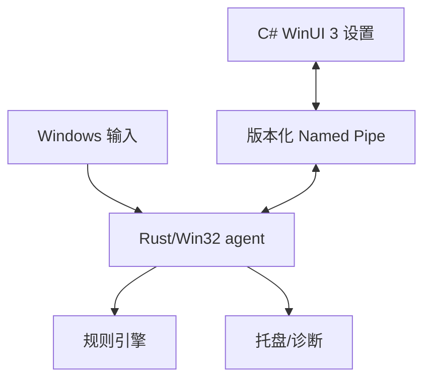

# InputFlow 项目规划与 AI 开发规格

> 文档类型：稳定产品规划与 AI 开发规格
>
> 当前进度：[`../status/CURRENT_STATUS.md`](../status/CURRENT_STATUS.md)
>
> 平台：Windows 10/11 桌面
>
> 本文用途：定义产品边界、架构约束、验收条件和开发顺序；后续 Codex 实现时以本文、ADR 和当前代码为准。
>
> 架构修订：桌面方案为“纯 Rust + Win32 常驻 agent”和“按需启动、关闭即退出的 C# + WinUI 3 设置程序”。详见 ADR-004。

## 0. 本轮发布决定与入口

用户已确定：首个 release 包含鼠标方向；24／72 小时长时间运行验收和长期 daily-drive 在首版发布后，不作为 Phase F、RC 或首版发布前置条件。发布前仍须完成自动回归、短时物理输入、关键恢复与最终包交付验证；已知核心输入／配置阻断缺陷必须修复。

顺序：F／M8 → G-PRE（短时可靠性）→ H（分发与生命周期）→ RC（有限最终包检查）→ 首个 Pre-release → G-POST（长测与加固）。WinUI 3 Settings 已完成 Phase E，后续扩展现有程序。完整路线见 [`RELEASE_ROADMAP.md`](RELEASE_ROADMAP.md)，文档入口见 [`../README.md`](../README.md)。

## 1. 产品定位

InputFlow 是 Windows 全局键盘与鼠标输入组合引擎。它像一把扳手：平时只保留小型后台工具，需要配置时才打开完整设置界面。程序只暂扣可能构成已启用规则的事件；匹配失败或超时时，按顺序尽力回放。

代表规则：

```text
按住左 Ctrl 至少 250 ms，再按下鼠标右键 → 执行 Ctrl+C
```

产品目标：

| 目标 | 可观察结果 |
|---|---|
| 低干扰 | 无候选事件直接放行；暂扣有期限、队列有上限。 |
| 可恢复 | 可暂停、旁路和退出；坏配置不阻止启动；异常路径停止继续拦截。 |
| 轻量常驻 | 设置窗口关闭后只有纯 Rust + Win32 agent 常驻，不加载 .NET、WinUI、WebView 或 JavaScript 运行时。 |
| Windows 原生 | 设置程序使用 C# + WinUI 3 / Windows App SDK 和系统交互习惯。 |
| 完整输入 | 支持 Caps/Num/Scroll Lock、OEM 符号、导航、数字键盘、媒体键等键盘身份。 |
| 可扩展鼠标 | 支持有显式激活条件的上/下/左/右鼠标移动规则，普通移动、点击和拖拽不受影响。 |
| 可验证 | 核心匹配器脱离 Windows API，以确定性事件序列测试。 |

## 2. 范围

### 2.1 M7 必须交付

- `inputflow-agent.exe`：纯 Rust + `windows-sys` + Win32；唯一 Hook、托盘、规则运行时、配置权威和 IPC 服务所有者。
- `InputFlow.Settings.exe`：C# + WinUI 3；按需启动，关闭最后一个窗口后进程退出，不安装 Hook、不隐藏到托盘。
- 当前交互用户可访问的版本化 Windows Named Pipe。
- 规则列表、编辑、启停/删除、状态、冲突/延迟提示、诊断、恢复与显式输入录制。
- 完整键盘身份的捕获、显示、配置、持久化和回放。
- Schema v4（v2 键身份 + v3 持久化启停 + 鼠标方向），并保持 Schema v1/v2/v3 可读和确定迁移。
- 可重复的 Rust、WinUI 和联合构建说明；真实 Windows 验收记录。

### 2.2 M8 目标

- 首个 release 必须包含“按住键盘激活键后，鼠标向上/下/左/右移动超过阈值”的方向触发器；同一激活键可配置四方向，每次按住最多触发一次。
- 明确定义距离、时间窗、偏轴容差、一次触发、重新武装和多显示器负坐标。
- move 全程直通，复用现有 KeyChord 动作和 WinUI 程序；鼠标按钮激活、设备来源、序列/层、按应用规则和原生触控板另开后续研究，不阻塞首版。

### 2.3 暂不包含

驱动、云同步、插件、跨平台、系统安全桌面、管理员程序的全面兼容、无激活条件的全局鼠标手势、保证完整重放鼠标轨迹。

### 2.4 首版交付与发布后工作

首版按 [`../tasks/FIRST_RELEASE.md`](../tasks/FIRST_RELEASE.md) 完成有限回归、x64 分发方案、运行依赖、路径、自启动、升级／移除、干净环境和最终包 smoke。默认建议 `v0.9.0-beta.1` Pre-release；最终版本与支持范围以真实产物和用户决定为准。MSIX、独立 installer、商业签名、商店和自动更新不是默认首版必需项；可运行、可移除的实际分发流程必须有证据。

发布后按 [`../tasks/POST_RELEASE_SOAK.md`](../tasks/POST_RELEASE_SOAK.md) 逐步完成 24／72 小时及 daily-drive。首版说明必须写明长测尚未完成，不提前承诺核心行为、Schema 或所有设备长期稳定。

## 3. 功能需求

| ID | 要求 | 验收依据 |
|---|---|---|
| FR-01 | 观察键盘和鼠标事件。 | 正确记录 down/up、按钮、滚轮、move、时间戳和 injected 标记。 |
| FR-02 | 仅暂扣已启用规则的候选前缀。 | 无规则时正常输入不受影响。 |
| FR-03 | 支持 Hold、Key+Key、Key+MouseButton。 | 阈值内外、成功、失败、暂停和冲突测试通过。 |
| FR-04 | 失败或超时后按序尽力回放。 | 普通快捷键无明显丢键、卡键或顺序翻转。 |
| FR-05 | 命中后只执行一次动作。 | 已消费按钮不产生原菜单；down/up 归属明确。 |
| FR-06 | 区分本程序注入。 | 回放和动作不递归触发。 |
| FR-07 | agent 统一验证、保存和热应用规则。 | UI 提交草稿；失败保持旧规则并返回结构化错误。 |
| FR-08 | 暂停、恢复、紧急旁路和退出。 | 设置程序断开时仍可安全控制并观察 agent。 |
| FR-09 | 匿名化诊断。 | 默认不记录文本内容；可观察 Hook、回放、IPC 和资源状态。 |
| FR-10 | 完整键盘。 | 往返锁定键、OEM 符号、导航、numpad、扩展键和媒体键。 |
| FR-11 | 鼠标方向。 | 只在激活条件满足时触发；普通移动/点击/拖拽直通。 |
| FR-12 | UI/运行时隔离。 | 关闭设置后 UI 进程消失，agent 和规则继续运行。 |

## 4. 不可破坏的不变量

1. Hook 是否抑制当前事件必须在该回调返回前决定。
2. Hook 热路径不得执行 GUI、磁盘、网络、无界分配、无界队列或等待 UI。
3. agent 是唯一 Hook 和正式配置所有者；设置程序不能直接改正式配置。
4. 所有 Win32 `unsafe`、句柄和线程生命周期集中在平台层，并记录清理不变量。
5. 每个物理 down 对应的 up 必须有明确归属；已消费 down 不把孤立 up 暴露给应用。
6. `SendInput` 检查实际插入数量；UIPI、焦点切换和崩溃导致的历史输入不可恢复必须如实记录。
7. F12（或已验证的可配置组合）始终保留为紧急旁路；录制模式不能吞掉它。
8. 配置应用必须是“验证 → 原子保存 → 热替换”的事务；任何一步失败都保留旧规则。
9. 不自动提升权限、不安装驱动、不修改系统级输入设置。
10. 单元测试或无输入 smoke 不能冒充真实 Windows 键鼠验收。

## 5. 运行时架构



| 模块 | 职责 |
|---|---|
| `inputflow-engine` | 平台无关事件、状态机、规则、暂扣、回放计划和统计。 |
| `inputflow-config` | 版本化配置、校验、原子保存、恢复和迁移。 |
| `inputflow-runtime` | probe/agent 共用的 start/ready/status/pause/resume/apply/capture/shutdown 生命周期与配置事务。 |
| `inputflow-windows` | Hook、消息循环、`SendInput`、托盘与 Win32 资源。 |
| `inputflow-protocol` | IPC DTO、版本、编解码、错误、并发 server 和兼容测试。 |
| `inputflow-agent` | 薄常驻入口；配置权威、托盘、单实例、本地诊断与 Phase D Named Pipe 服务。 |
| `settings-winui` | Phase E 已接入规则草稿/编辑/启停/录制、状态、诊断和 apply reconciliation；不复制后端业务规则。 |

Named Pipe 至少定义：handshake、协议版本、请求 ID、超时、status、validate、apply、pause/resume、recording start/cancel/result、diagnostics、断线重连、错误码和当前交互用户 ACL。

## 6. 输入身份与配置

完整键盘不只扩充字符串白名单。ADR-005 已选择事件双身份和规则显式 match mode；ADR-007 在该键身份之上加入 Schema v3 规则启停：

- logical VK 与 physical scan code + extended 分开持久化；exact physical 匹配优先，内部 release tracking 优先 physical。
- 已区分左右修饰、主键区/数字键盘、keypad Enter、PrintScreen、Pause、Menu 和媒体键。
- OEM 保存稳定 `Oem*` 或 physical identity；当前 WinUI 按布局动态查询显示名称，不写入稳定配置。
- Caps 自动测试覆盖命中、失败回放、暂停/控制冲刷、自动重复、overflow 和 down/up 数量；en-US/Microsoft Pinyin 目标字符、失败回放、命中消费、`F12` pending 恢复和键盘指示灯已有真实物理输入证据。
- 未知 VK 在观察/回放路径保留原始值，不静默映射；配置只允许已知 logical 或非零 physical scan。
- Schema v1/v2/v3 可读并内存迁移为 v4；旧规则默认启用，disabled 规则保留但不进入运行时索引；golden fixture 和 backup 回滚测试已落地。

鼠标方向第一版：

- 首版必须有键盘激活键；鼠标按钮激活后续独立评估，不做无条件全局手势。
- move 热路径使用预编译固定四槽组和 O(1) 净位移计算，不逐点记录、不发送到 IPC 或无界队列。
- 第一版 move 始终直通，不抑制／重放轨迹，不复位光标。
- 激活键 down／repeat／up 的暂扣、失败回放和命中释放归属已由 ADR-008 固定；移动不进入 PendingQueue。
- 同一键四方向组合法，跨类型前缀冲突与 physical 优先继承既有策略；每次按住最多一次，释放后重新武装。
- 方向配置使用严格 Schema v4，保留 v1／v2／v3 读取、enabled 和备份语义；Rust／C# fixture、protocol v1 handshake 和 WinUI 编辑／有限预览已同步。真实四方向、普通输入／拖拽和五分钟物理 move 已在 Phase F 收口；单屏环境限制见归档记录。

## 7. 技术选型与构建

| 层 | 选型 |
|---|---|
| 常驻程序 | Rust stable + `windows-sys` + Win32 |
| 输入 | `WH_KEYBOARD_LL`、`WH_MOUSE_LL`、`SendInput` |
| 设置程序 | C# + WinUI 3 / Windows App SDK |
| IPC | Windows Named Pipe + 版本化消息 |
| 配置 | JSON + serde，Schema v1/v2/v3→v4 兼容 |
| 构建 | Cargo + dotnet/MSBuild + Windows 实机 |

项目不使用 Tauri 2、React、Node.js、npm、WebView2 或 Electron。开发机版本、Visual Studio 工作负载、.NET SDK、Windows SDK、Windows App SDK、WinUI 模板、packaged/unpackaged 决策和真实命令必须写入 [`../guides/BUILD_WINDOWS.md`](../guides/BUILD_WINDOWS.md)，不能猜测为已验证。

目标结构：

```text
inputflow/
├── apps/
│   ├── probe-cli/
│   ├── inputflow-agent/       # M7 Phase C 已建立
│   └── settings-winui/        # M7 Phase E 正式设置、状态核心、协议与测试 runners
├── crates/
│   ├── inputflow-engine/
│   ├── inputflow-config/
│   ├── inputflow-runtime/
│   ├── inputflow-windows/
│   └── inputflow-protocol/    # M7 Phase D 已建立
├── docs/
│   ├── status/
│   ├── tasks/
│   ├── records/
│   ├── guides/
│   ├── reference/
│   ├── decisions/
│   └── archive/
└── scripts/
```

## 8. 里程碑

本节只定义交付范围，不保存会随执行变化的状态。当前完成情况、实际测试数量和下一步统一见
[`../status/CURRENT_STATUS.md`](../status/CURRENT_STATUS.md)。

| 阶段 | 交付范围 |
|---|---|
| M1–M5 | 探针、抑制／回放、状态机、组合与时序规则 |
| M6 | 暂停、配置恢复、诊断和可靠性加固 |
| M7 A–E | WinUI 工具链、完整键身份、Rust Agent、Named Pipe 和正式设置程序 |
| Phase F／M8 | 键盘激活鼠标四方向、Schema、WinUI 扩展和现场验收 |
| G-PRE | 自动回归、短时混合输入和关键异常恢复 |
| H | 分发、依赖、路径、自启动、升级／移除和干净环境 |
| RC／首个 release | 固定最终包、有限 smoke、发布材料和 Pre-release |
| G-POST | 24／72 小时长测、daily-drive 和后续加固 |

## 9. 验证矩阵

自动测试至少覆盖：

- 前缀不存在、匹配/失败/临界超时、多候选、repeat、暂停、配置替换、队列满和动作一次性。
- Caps/Num/Scroll Lock、左右/扩展、OEM、numpad、媒体键和 Schema v1/v2/v3→v4。
- IPC 版本、畸形消息、超时、断线、重连、并发请求和旧客户端拒绝/兼容。
- 鼠标方向抖动、阈值、超时、偏轴、一次触发、激活提前释放、多显示器负坐标。
- 设置进程退出、agent 重启、坏配置、失败保存与旧规则保持。

Windows 实机至少覆盖：

- 记事本、浏览器、资源管理器中的打字、快捷键、菜单、点击和拖拽。
- 普通/提升权限窗口、输入法、不同键盘布局、其他输入工具共存。
- Caps Lock 指示状态、OEM 符号、numpad Enter、媒体键、PrintScreen/Pause。
- UI 打开/关闭、Named Pipe 断开、agent 独立运行和托盘紧急旁路。
- 高频鼠标移动下的 CPU、工作集、线程、句柄、回调 p50/p95/p99/max 和 Hook 存活。

每项必须区分“代码可证”“故障注入可证”“真实 Windows 目标程序已观察”“未执行”。当前无法获得的特殊键、多屏、高频硬件或语音环境明确保留限制；未来兼容矩阵不自动成为首版无限等待条件。首版具体短时门槛见发布路线与当前任务卡；24／72 小时长测仅在发布后执行。

## 10. 风险与待写 ADR

- Hook 超时可能被系统静默移除；保持回调有界并做高负载存活测试。
- `SendInput` 受 UIPI、当前修饰状态和焦点变化影响，不能承诺 100% 原样回放。
- 高频 move 可能放大锁竞争和日志成本；不得逐点跨线程传输。
- WinUI/IPC 故障不能拖垮 agent；协议需版本、超时、ACL 和重连策略。
- 键盘布局变化会影响 OEM 键显示与语义；输入身份策略必须先于 UI 接线。

M7/M8 设计 ADR 状态：

1. ADR-005：完整按键身份与 Schema v2（已接受）。
2. ADR-006：Named Pipe 协议、ACL、版本和配置事务。
3. ADR-007：持久化规则启停与 Schema v3（已接受）。
4. ADR-008：鼠标方向、激活键归属、直通策略、Schema 和性能上界（已接受）。
5. ADR-009：首版分发与用户生命周期（待写；编号被占用则顺延）。

## 11. 交给 Codex 的执行约定

1. 先阅读 [`../README.md`](../README.md)、[`../status/CURRENT_STATUS.md`](../status/CURRENT_STATUS.md)、实际 `AGENTS.md`／Git 状态、本文、发布路线、构建指南、ADR-000～008 和当前代码。
2. 只执行当前状态文件指定的任务卡；F 完成后进入首个 Release 收尾任务，顺序为 G-PRE → H → RC → 首版。不要从 archive 的旧任务重新开工。
3. 每阶段先基线与方案，再行为测试、实现、Windows 验证和记录；改动既有语义先说明与更新 ADR，不丢弃 M6 正确性修复。
4. UI 只负责展示和提交草稿；配置权威、Hook、owner 串行化和安全降级仍在 Agent。SendInput 前释放 matcher 锁，保留重入回归。
5. 更新当前阶段的 `docs/records/` 文件；自动／故障注入／脚本／物理输入及继承基线分开，报告实际提交、命令结果、环境、资源和限制。
6. 24／72 小时长测与长期自用在首版发布后执行。不要为这些时长阻塞首版，也不把首版称为已经证明长期稳定。
7. 完成本地包与可审阅发布草稿后，按用户已有对应授权决定实际远端发布；文档开发请求不等于远端发布授权。

### 执行入口

下一项不在本规划中重复维护；以 [`../status/CURRENT_STATUS.md`](../status/CURRENT_STATUS.md) 的“下一步”为准。
